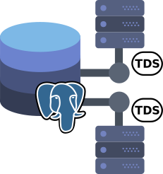

# TDS Foreign data wrapper

* **Author:** Geoff Montee
* **Name:** tds_fdw
* **File:** tds_fdw/README.md

## Logo

## About

This is a [PostgreSQL foreign data wrapper](https://wiki.postgresql.org/wiki/Foreign_data_wrappers) that can connect to databases that use the [Tabular Data Stream (TDS) protocol](https://en.wikipedia.org/wiki/Tabular_Data_Stream),
such as Sybase databases and Microsoft SQL server.

This foreign data wrapper requires a library that implements the DB-Library interface,
such as [FreeTDS](https://www.freetds.org). This has been tested with FreeTDS, but not
the proprietary implementations of DB-Library.

This should support PostgreSQL 9.2+.

The current version does not yet support JOIN push-down, or write operations.

It does support WHERE and column pushdowns when *match_column_names* is enabled.

## Build Status

|                |    CentOS 7    |    Rocky Linux 8   |    Ubuntu 20.04   | openSUSE Leap 15.5 |
| --------------:|:--------------:|:------------------:|:-----------------:|:------------------:|
| **PostgreSQL 12**  |||||
| **PostgreSQL 13**  |||||
| **PostgreSQL 14**  |||||
| **PostgreSQL 15**  |||||
| **PostgreSQL 16**  |N/A||||

## Installing on RHEL and clones (CentOS, Rocky Linux, AlmaLinux, Oracle...)

See [installing tds_fdw on CentOS](InstallRHELandClones.md).

## Installing on Ubuntu

See [installing tds_fdw on Ubuntu](InstallUbuntu.md).

## Installing on Debian

See [installing tds_fdw on Debian](InstallDebian.md).

## Installing on openSUSE

See [installing tds_fdw on openSUSE](InstallopenSUSE.md).

## Installing on OSX

See [installing tds_fdw on OSX](InstallOSX.md).

## Installing on Alpine (and Docker)

See [installing tds_fdw on Alpine](InstallAlpine.md).

## Usage

### Foreign server

See [creating a foreign server](ForeignServerCreation.md).
	
### Foreign table
	
See [creating a foreign table](ForeignTableCreation.md).
	
### User mapping
	
See [creating a user mapping](UserMappingCreation.md).

### Foreign schema

See [importing a foreign schema](ForeignSchemaImporting.md).

### Variables

See [variables](Variables.md).

### `EXPLAIN`

`EXPLAIN (VERBOSE)` will show the query issued on the remote system.
	
## Notes about character sets/encoding

1. If you get an error like this with MS SQL Server when working with Unicode data:
   
   > NOTICE:  DB-Library notice: Msg #: 4004, Msg state: 1, Msg: Unicode data in a Unicode-only 
   > collation or ntext data cannot be sent to clients using DB-Library (such as ISQL) or ODBC 
   > version 3.7 or earlier., Server: PILLIUM\SQLEXPRESS, Process: , Line: 1, Level: 16  
   > ERROR:  DB-Library error: DB #: 4004, DB Msg: General SQL Server error: Check messages from 
   > the SQL Server, OS #: -1, OS Msg: (null), Level: 16
   
   You may have to manually set *tds version* in *freetds.conf* to 7.0 or higher. See [The *freetds.conf* File](https://www.freetds.org/userguide/freetdsconf.html).
   and [Choosing a TDS protocol version](https://www.freetds.org/userguide/ChoosingTdsProtocol.html).

2. Although many newer versions of the TDS protocol will only use USC-2 to communicate
with the server, FreeTDS converts the UCS-2 to the client character set of your choice. 
To set the client character set, you can set *client charset* in *freetds.conf*. See 
[The *freetds.conf* File](https://www.freetds.org/userguide/freetdsconf.html) and [Localization and TDS 7.0](https://www.freetds.org/userguide/Localization.html).

## Encrypted connections to MSSQL

It is handled by FreeTDS, so this needs to be configured at the `freetds.conf`. Seee [The *freetds.conf* File](https://www.freetds.org/userguide/freetdsconf.html) and at `freetds.conf settings` look for `encryption`.

## Support

If you find any bugs, or you would like to request enhancements, please submit your comments on the [project's GitHub Issues page](https://github.com/tds-fdw/tds_fdw/issues).

Additionally, I do subscribe to several [PostgreSQL mailing lists](https://www.postgresql.org/list/) including *pgsql-general* and *pgsql-hackers*. If tds_fdw is mentioned in an email sent to one of those lists, I typically see it.

## Debugging

See [Debugging](tests/README.md)

